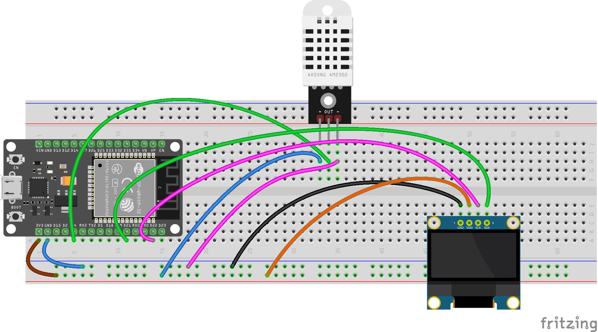

# DHT22 with I2C Display on ESP32
This project demonstrates how to read temperature and humidity data from a DHT22 sensor and display it on an I2C OLED display using an ESP32 microcontroller.

## Precheck
Create the secrets.h file in the same directory as the sketch and add the following content:
```cpp
#ifndef SECRETS_H

#define WIFI_SSID "your_wifi_ssid"
#define WIFI_PASSWORD "your_wifi_password"

#endif
```

## Components Required
- ESP32 development board
- DHT22 temperature and humidity sensor
- I2C OLED display (e.g., SSD1306)
- Jumper wires
- Breadboard (optional)
- Power supply (USB or battery)

## Circuit Diagram


## Libraries Required
- `Adafruit_Sensor` for sensor data handling
- `DHT` for DHT22 sensor
- `Wire` for I2C communication
- `Adafruit_GFX` for graphics support
- `Adafruit_SSD1306` for OLED display
- `ArduinoJson` for StaticJsonDocument
